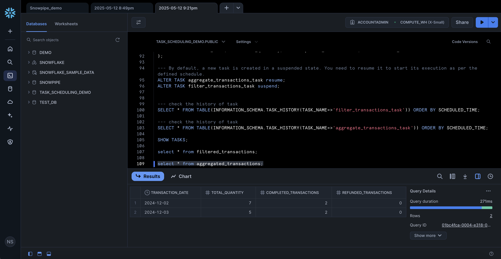
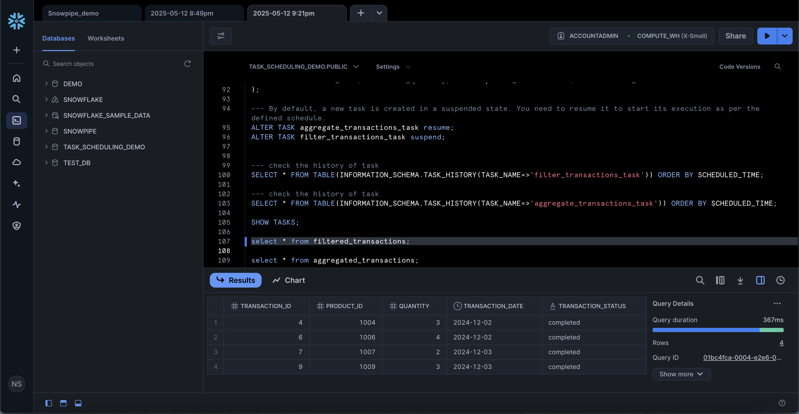

# 📅 Task Scheduling in Snowflake

This project demonstrates how to automate data operations in **Snowflake** using **Tasks**. The primary focus is on creating a daily schedule to insert, update, or transform data within a Snowflake table using SQL scripts.

---

## 📌 Objectives

- Set up a scheduled task in Snowflake.
- Automate a SQL query to run at a specified interval.
- Monitor task execution and status.

---

## 📁 File Structure

```
Task-Scheduling-in-Snowflake/
│
├── Task_scheduling.sql              # SQL script to create and manage Snowflake tasks
├── screenshots/
│   ├── agg_transactions.png
│   └── filtered_transactions.png
```

---

## 🧾 SQL Task Overview

The SQL script includes:

- Task creation:
  ```sql
  CREATE OR REPLACE TASK daily_task
  WAREHOUSE = compute_wh
  SCHEDULE = 'USING CRON 0 9 * * * UTC'
  AS
  INSERT INTO my_table SELECT * FROM staging_table;
  ```

- Enabling the task:
  ```sql
  ALTER TASK daily_task RESUME;
  ```

- Checking task history:
  ```sql
  SELECT * FROM TABLE(INFORMATION_SCHEMA.TASK_HISTORY(TASK_NAME=>'daily_task'));
  ```

---

## 📸 Screenshots

### ✅ Results





---

## ✅ Result

With this setup, Snowflake can now autonomously run SQL queries at your defined schedule, reducing the need for manual execution and enhancing workflow automation.
